# Noughts and Crosses
(Developer: Kieran Merrett)

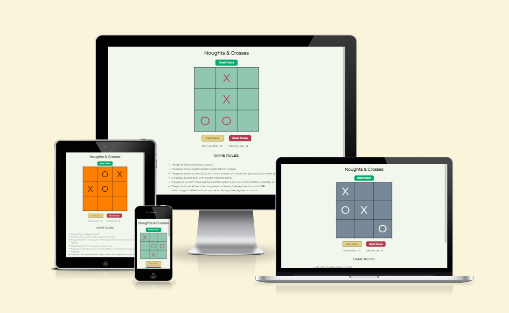

[Live webpage](https://kiemerr17.github.io/noughts-crosses/)

## Table of Content

1. [Project Goals](#project-goals)
    1. [User Goals](#user-goals)
    2. [Site Owner Goals](#site-owner-goals)
2. [User Experience](#user-experience)
    1. [Target Audience](#target-audience)
    2. [User Requrements and Expectations](#user-requrements-and-expectations)
    3. [User Stories](#user-stories)
3. [Design](#design)
    1. [Design Choices](#design-choices)
    2. [Colour](#colours)
    3. [Fonts](#fonts)
    4. [Structure](#structure)
    5. [Wireframes](#wireframes)
4. [Technologies Used](#technologies-used)
    1. [Languages](#languages)
    2. [Frameworks & Tools](#frameworks-&-tools)
5. [Features](#features)
6. [Testing](#validation)
    1. [HTML Validation](#HTML-validation)
    2. [CSS Validation](#CSS-validation)
    3. [Accessibility](#accessibility)
    4. [Performance](#performance)
    5. [Device testing](#performing-tests-on-various-devices)
    6. [Browser compatibility](#browser-compatability)
    7. [Testing user stories](#testing-user-stories)
8. [Bugs](#Bugs)
9. [Deployment](#deployment)
10. [Credits](#credits)
11. [Acknowledgements](#acknowledgements)

## Project Goals 

### User Goals
- Be able to play a game of Noughts aand Crosses against a computer.
- Be able to track scoring for games won vs games lost.
- Be able to see clearly the rules associated to the game.

### Site Owner Goals
- For the game to function with no issues.
- Users to have a fun experience when playing.
- Tracking of scores to be consistent.

## User Experience

### Target Audience
- People of all ages looking to play a game of Noughts and Crosses against a computer opponent.

### User Requrements and Expectations
- All functions to work as expected
- A fully responsive design across all screen sizes
- A design which is appealing to the eye

## User Stories

#### First-time User 
1. As a first time user, I want to know what the page is about upon arrival
2. As a first time user, I want to know the rules associated with Noughts and Crosses
3. As a first time user, I want to know where i will be playing the game
#### Returning User
4. As a retruning user, I want to be able to see my scores of games won vs games lost
5. As a retruning user, I want to be able to reset my scores and clear all previous scores

#### Site Owner 
6. As the site owner, I want users to feel challenged in their games
7. As the site owner, I want users to have a full understanding of the layout of the page and where to play the game
8. As the site owner, I want users to see if a page cannot be found, 404 page.

## Design

### Design Choices
The webpage was designed with a simplicity feel to give the user a quick and easy understanding of the page layout and where to play the game

### Colours
For the color scheme i used mellow colors to be easy on the eye with bold colors on on the buttons to represent the purpose of the button.
(eg. red for warning) 
The inspiration for the colors was taken from a image found on Google.  
The colors chosen are displayed and coded into the files using basic '#' color coding
 

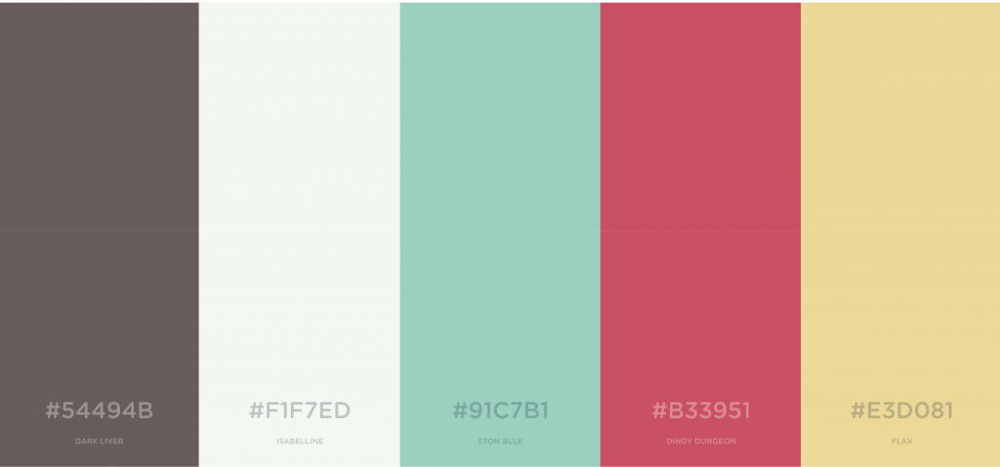

### Fonts
Montserrat was used across the page to match in with the smooth easy feel i was looking to acheive in the design period.
Sans-serif was used as a back-up font should Montserrat not be available.

### Structure
The page is structured in a user friendly, and easy to learn way. When arriving to the website the user sees a gameboard area in the center of the page, wit a fully detailed list of game rules beneath to describe how to play the game.

The website consists 1 page: 
- A Home Page - This is where the user will engage in playing the game.

### Wireframes

Home Page

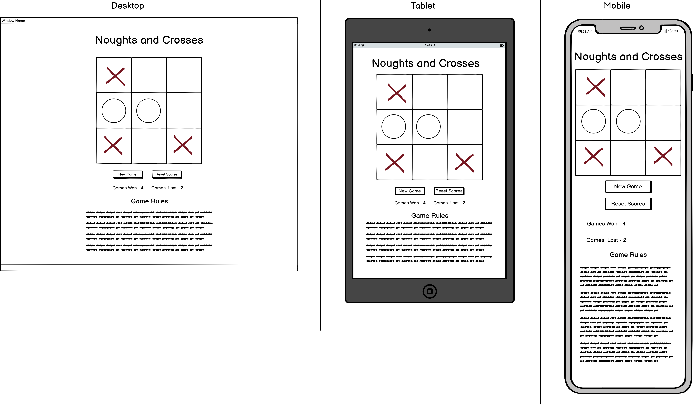

404

## Technologies Used

### Languages
- HTML
- CSS
- JavaScript

### Frameworks & Tools
- GitHub
- Gitpod
- Balsamiq
- Google Fonts
- Google Images
- Favicon.io
- TinyPNG

## Features
The page consists of one page with seven features

### Homepage
- This page is where the user will arrive.
- User stories covered: 1, 7

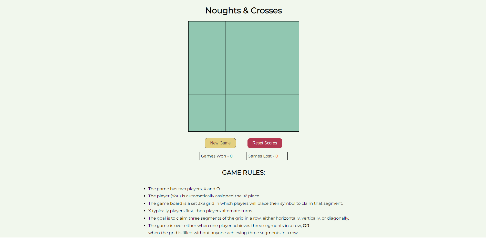

### Header and Logo
- Displayed to give reference to the user they have arrived at the correct page
- User stories covered: 1

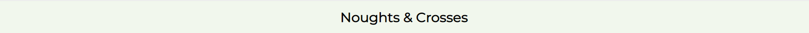

### Gameboard 
- This is where the user will interact with the page and pay the game against the computer
- User stories covered: 3, 6

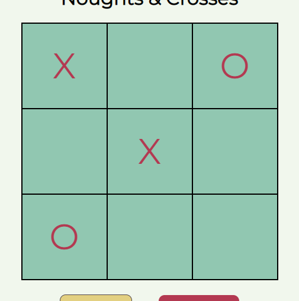

### Game Buttons
- Use of these buttons will do either of the following:
  - 'NewGame' - If the board has no more available squares to play and no winner is acheived, this resets the board to a new game but keeps the current score total
  - 'Reset Scores' - If the user wants to switch person or start fresh themselves, this button will reset the scores and initiate a new game to start
- User stories covered: 5

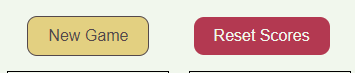

### Scores Area
- These boxes display the current total for games won vs games lost.
- Games won score total will increase when the player "X" wins. 
- Games lost score total will increase when the computer "O" wins
- User stories covered: 4

### Game Rules
- Here the user can find a detailed list of game rules and how to play.
- It informs the user that their symbol will be "X"
- User stories covered: 2, 3

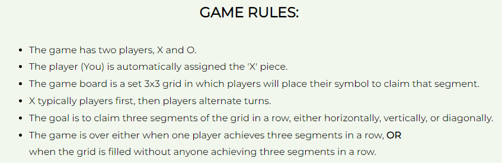

### 404 Page
- Description...
- User stories covered: 8

## Validation

### HTML Validation
The W3C Markup Validation Service was used to validate the HTML of the website. All pages pass with no errors no warnings to show.

Home Page

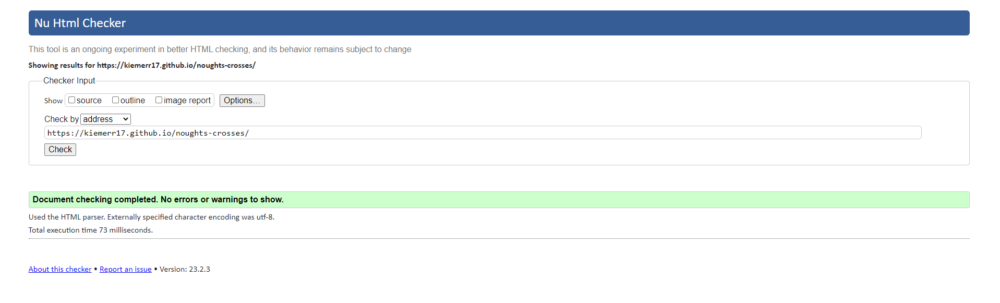

 

### CSS Validation
The W3C Jigsaw CSS Validation Service was used to validate the CSS of the website. Tested stylesheet.css and it passed with no errors no warnings to show.

stylesheet.css

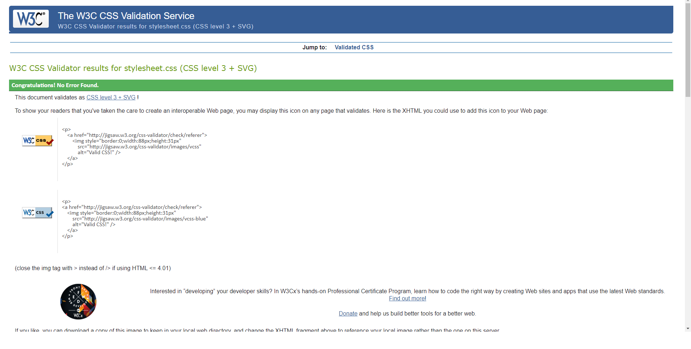

 

### JavaScript Validation
The JSHint website was used to validate the JavaScript of the website. 
It passed with no errors and the following warning raised:

"One unused variable: 196 resetGame"

JavaScript Validation

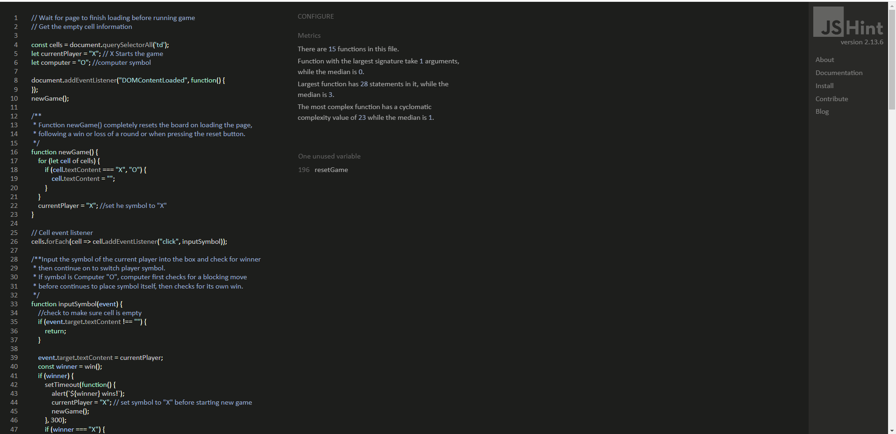

** This warning is the function 'resetGame()' 
It is used in the index.html file and is linked to a on-click attribute attached to the 'reset scores' button.   See attached screenshot.

resetGame() reference image

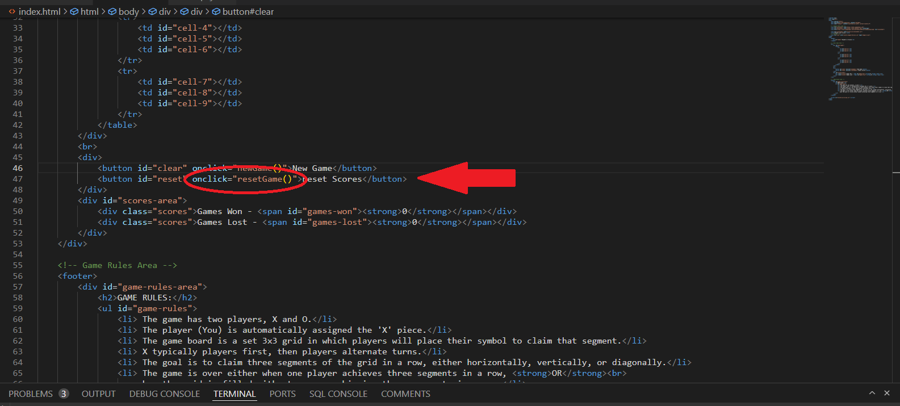

 

### Accessibility
The WAVE WebAIM web accessibility evaluation tool was used to ensure the website met high accessibility standards. All pages pass with 0 errors. The alerts on the pages are due to Home Page link being near the Link to the homepage through the logo being in close proximity of one another.

Home Page

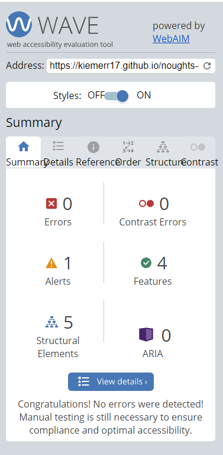

 

### Performance 
Google Lighthouse in Google Chrome Developer Tools was used to test the performance of the website. 

Home Page

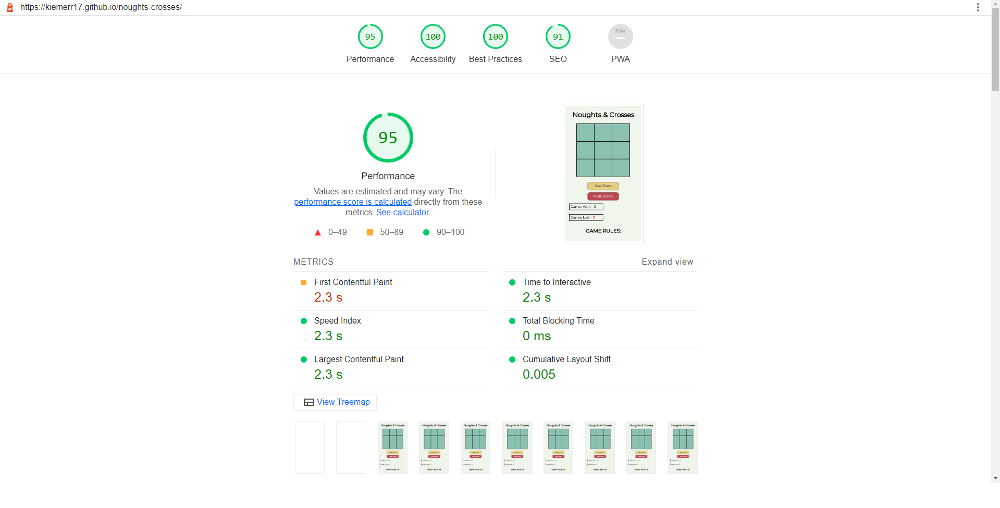

 

### Performing tests on various devices 
I've tested my website on the following devices:
- Huawei Mate pad Pro (both in pc and tablet mode)
- Iphone 12
- Dell G3 Laptop

I also tested the site using Google Chrome Developer Tools, adjusting for all available devices.

### Browser compatability
The website was tested on the following browsers:
- Google Chrome
- Microsoft Egde

### Testing user stories

1. As a first time user, I want to know what the page is about upon arrival

| **Feature** | **Action** | **Expected Result** | **Actual Result** |
|-------------|------------|---------------------|-------------------|
|Header and logo | Navigate to the homepage where you will find the header and logo | clear precise understanding of what the page is about | Works as expected|
| Game Rules | Navigate to the home page and scroll to the bottom of the page to see a list of the rules about the game | Find a detailed list of the game rules | Worked as expected |

Screenshots

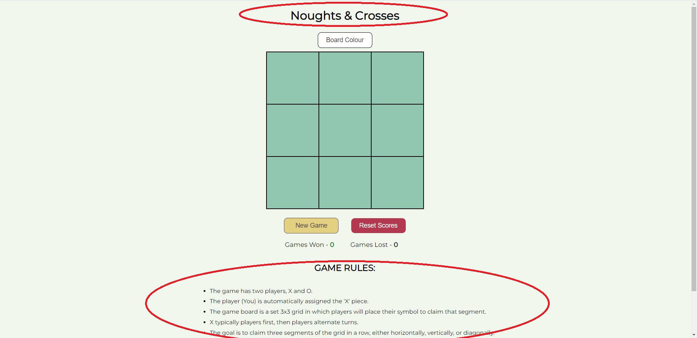

 

2. As a first time user, I want to know the rules associated with Noughts and Crosses

| **Feature** | **Action** | **Expected Result** | **Actual Result** |
|-------------|------------|---------------------|-------------------|
| Game Rules | Navigate to the home page and scroll to the bottom of the page to see a list of the rules about the game | Find a detailed list of the game rules | Worked as expected |

Screenshots

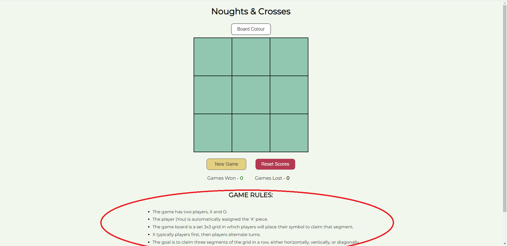

 

3. As a first time user, I want to know where i will be playing the game

| **Feature** | **Action** | **Expected Result** | **Actual Result** |
|-------------|------------|---------------------|-------------------|
| Gameboard | Navigate to the homepage and you will see a green gameboard presented for you to interact with the game | See a gameboard present for me to play the game | Worked as expected |

Screenshots

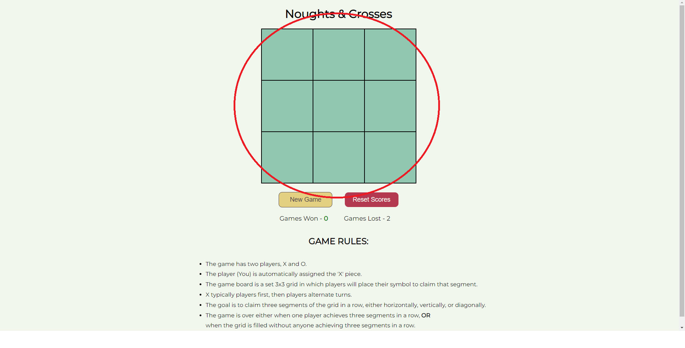

 

4. As a retruning user, I want to be able to see my scores of games won vs games lost

| **Feature** | **Action** | **Expected Result** | **Actual Result** |
|-------------|------------|---------------------|-------------------|
| Scores Area | Following a win or loss, scroll down the page to see the sections detailing scores total | See a running total of my games won and games lost totals | worked as expected |

Screenshots

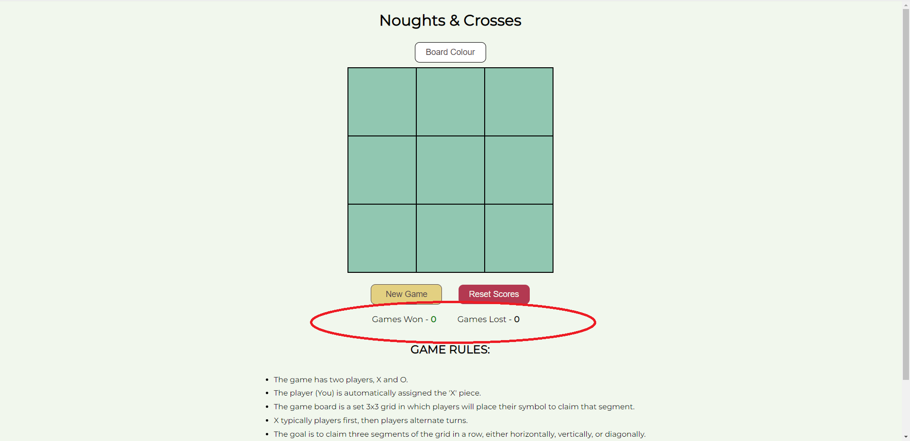

 

5. As a retruning user, I want to be able to reset my scores and clear all previous scores

| **Feature** | **Action** | **Expected Result** | **Actual Result** |
|-------------|------------|---------------------|-------------------|
| Game Buttons | Scroll down the page to see the 'Reset Scores' button, click it. | The total for games won and for games lost should reset to '0' and a new game should be presented | Worked as expected |

Screenshots

 

6. As the site owner, I want users to feel challenged in their games

| **Feature** | **Action** | **Expected Result** | **Actual Result** |
|-------------|------------|---------------------|-------------------|
| Gameboard | Interact with the gameboard and see the computer responds to your input | When playing your symbol, the computer finds a empty square to place their symbol | Worked as expected |

Screenshots

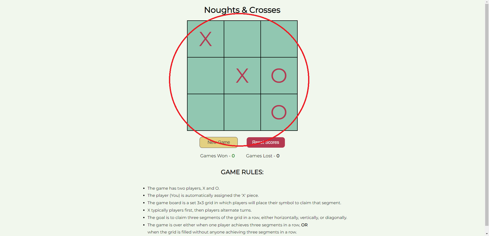

 

7. As the site owner, I want users to have a full understanding of the layout of the page and where to play the game

| **Feature** | **Action** | **Expected Result** | **Actual Result** |
|-------------|------------|---------------------|-------------------|
| Homepage | Load the homepage and see a easy to understand landing screen| | |

Screenshots

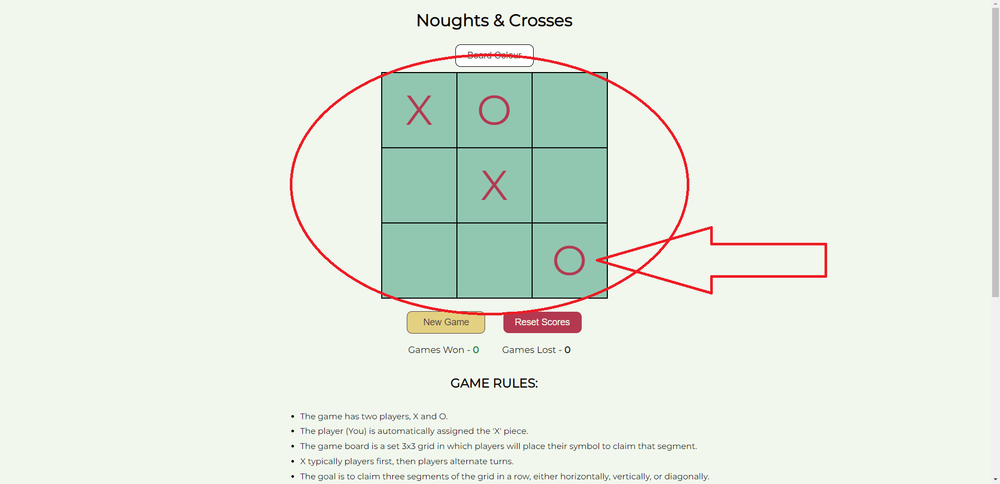

 

8. As the site owner, I want users to see if a page cannot be found, 404 page.

| **Feature** | **Action** | **Expected Result** | **Actual Result** |
|-------------|------------|---------------------|-------------------|
| | | | |

Screenshots

 

## Bugs

| **Bug** | **Fix** |
| ----------- | ----------- |
| | |
| | |

## Deployment
The website was deployed using GitHub Pages by following these steps:
1. In the GitHub repository navigate to the Settings tab
2. On the left hand menu select Pages
3. For the source select Branch: main
4. After the webpage refreshes automaticaly you will se a ribbon on the top saying: "Your site is published at https://kiemerr17.github.io/surfs-up/index.html"

You can for fork the repository by following these steps:
1. Go to the GitHub repository
2. Click on Fork button in upper right hand corner

You can clone the repository by following these steps:
1. Go to the GitHub repository 
2. Locate the Code button above the list of files and click it 
3. Select if you prefere to clone using HTTPS or Github CLI and click the copy button to copy the URL to your clipboard
4. Open Git Bash
5. Change the current working directory to the one where you want the cloned directory
6. Type git clone and paste the URL from the clipboard ($ git clone https://github.com/YOUR-USERNAME/YOUR-REPOSITORY)
7. Press Enter to create your local clone.

## Credits

### Media
  
### Code

## Acknowledgements
I would like to take the opportunity to thank:
- My mentor Mo Shami for his advice, guidance and support.
- To Code Institute Slack members for providing support when needed.